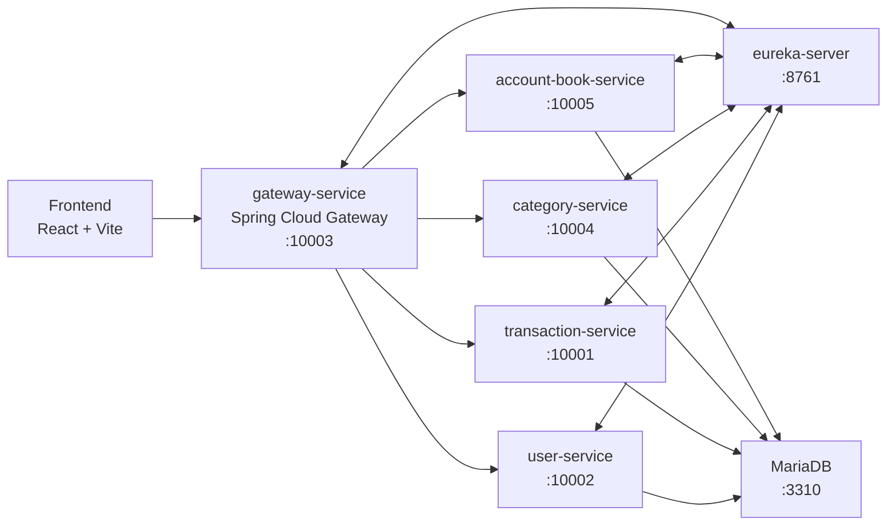
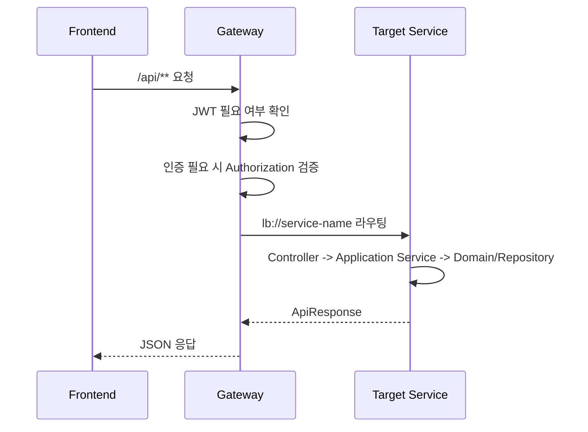
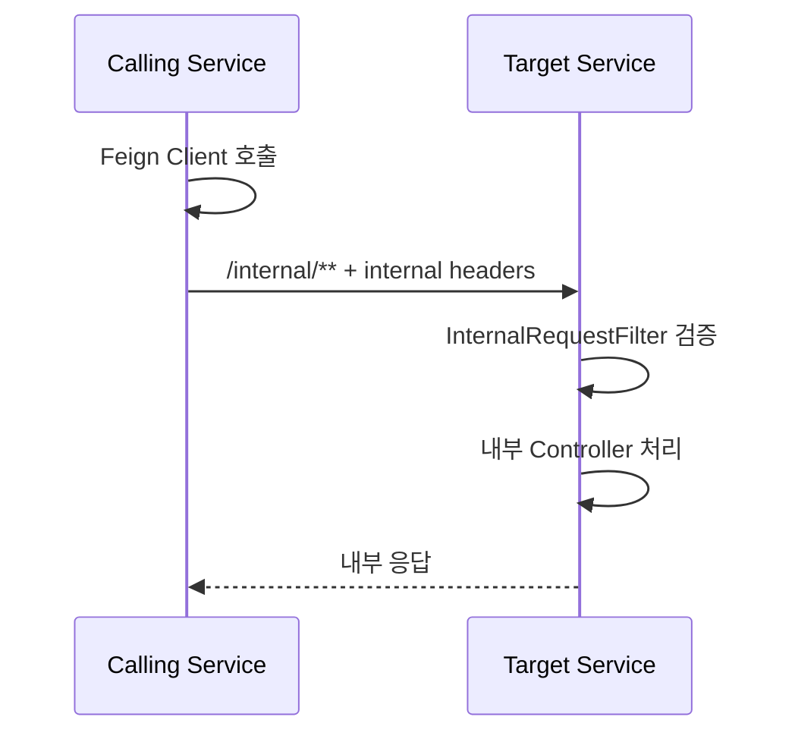

# Sodam 시스템 아키텍처 문서

## 문서 목적

이 문서는 Sodam 프로젝트의 전체 시스템 구조, 서비스 책임, 요청 흐름, 서비스 간 통신, 데이터 저장 전략을 정리한다.

## 전체 구조

Sodam은 Spring Cloud 기반 MSA 백엔드와 Vite/React 프론트엔드로 구성된다. 외부 클라이언트는 Gateway를 통해 `/api/**` 공개 API에 접근하고, 백엔드 서비스 간 호출은 Eureka 서비스 디스커버리와 Feign을 사용한다.

## 서비스 구성

| 서비스 | 책임 | 공개 API |
| --- | --- | --- |
| `gateway-service` | 외부 요청 진입점, JWT 필터, 라우팅, `/internal/**` 차단 | 없음 |
| `user-service` | 회원가입, 로그인, 로그아웃, 토큰 재발급, 사용자 조회 | `/api/auth/**` |
| `account-book-service` | 가계부 생성/조회/수정/삭제, 가계부 멤버 관리 | `/api/account-books/**` |
| `category-service` | 카테고리 관리, 가계부별 분류 조회/생성 | `/api/categories/**`, `/api/classifications/**` |
| `transaction-service` | 거래 CRUD, 거래 목록 검색, 카테고리 이동, 통계 | `/api/transactions/**`, `/api/stat/**` |
| `common-module` | 공통 응답, 예외 처리, 사용자 컨텍스트, 내부 API 보안, Feign 공통 설정 | 없음 |
| `eureka-server` | 서비스 등록/조회 | Eureka Dashboard |

## 요청 흐름

### 공개 API 요청

### 내부 API 요청

내부 API는 Gateway를 거치지 않는다. Gateway는 `/internal/**` 요청을 `404 NOT_FOUND`로 차단한다.

## Gateway 라우팅

| Path | Target | JWT 필터 |
| --- | --- | --- |
| `/api/auth/login` | `user-service` | 없음 |
| `/api/auth/logout` | `user-service` | 없음 |
| `/api/auth/register` | `user-service` | 없음 |
| `/api/auth/reissue` | `user-service` | 없음 |
| `/api/auth/**` | `user-service` | 적용 |
| `/api/transactions/**` | `transaction-service` | 적용 |
| `/api/stat/**` | `transaction-service` | 적용 |
| `/api/categories/**` | `category-service` | 적용 |
| `/api/classifications/**` | `category-service` | 적용 |
| `/api/account-books/**` | `account-book-service` | 적용 |
| `/internal/**` | 차단 | `404 NOT_FOUND` |

## 인증 구조

| 토큰 | 저장 위치 | 용도 |
| --- | --- | --- |
| Access Token | 프론트엔드 메모리 | API 인증 헤더 |
| Refresh Token | HttpOnly Secure Cookie | Access Token 재발급 |

프론트엔드는 API 요청 시 access token을 `Authorization: Bearer {token}` 헤더에 추가한다. `401` 응답을 받으면 `/api/auth/reissue`로 새 access token을 요청하고, 성공하면 원래 요청을 재시도한다.

## 서비스 간 연동

| 호출 주체 | 대상 | 목적 |
| --- | --- | --- |
| `user-service` | `account-book-service` | 회원가입 후 기본 가계부 생성 |
| `user-service` | `category-service` | 회원가입 후 `INCOME`, `EXPENSE` 기본 분류 생성 |
| `account-book-service` | `user-service` | 이메일 기준 사용자 ID 조회 |
| `category-service` | `user-service` | 이메일 기준 사용자 ID 조회 |
| `category-service` | `transaction-service` | 카테고리 삭제 전 거래 카테고리 일괄 이동 |
| `transaction-service` | `user-service` | 이메일 기준 사용자 ID 조회 |
| `transaction-service` | `category-service` | 거래 목록 응답에 카테고리명 보강 |

## 데이터 저장 전략

각 업무 서비스는 동일 MariaDB 인스턴스를 사용하지만 Flyway schema history table은 서비스별로 분리한다.

| 서비스 | Flyway history table |
| --- | --- |
| `user-service` | `flyway_schema_history_user_service` |
| `account-book-service` | `flyway_schema_history_account_book_service` |
| `category-service` | `flyway_schema_history_category_service` |
| `transaction-service` | `flyway_schema_history_transaction_service` |

JPA 설정은 `ddl-auto: validate`를 사용한다. 스키마 생성/변경은 Flyway migration으로 수행하고, 애플리케이션 시작 시 JPA가 엔티티와 DB 스키마 일치 여부를 검증한다.

## 패키지 계층

서비스들은 대체로 다음 계층 구조를 따른다.

| 계층 | 역할 |
| --- | --- |
| `application.api.controller` | HTTP 요청/응답 처리 |
| `application.api.dto` | 요청/응답 DTO |
| `application.service` | 유스케이스 조립, 외부 서비스 연동, 트랜잭션 경계 |
| `domain.model` | 도메인 엔티티 및 값 |
| `domain.service` | 도메인 규칙 |
| `domain.repository` | 데이터 접근 |
| `infrastructure` | Feign client, 외부 DTO |

## 주요 품질 속성

| 속성 | 구현 방식 |
| --- | --- |
| 인증 | Gateway JWT 필터와 refresh token 재발급 |
| 내부 API 보호 | Gateway 차단, 내부 헤더 검증, Feign interceptor |
| 추적성 | `X-Correlation-Id` 기반 요청 추적 지원 |
| DB 변경 안정성 | Flyway migration + JPA validate |
| 테스트 용이성 | Controller, Application Service, Domain Service, Repository 계층별 테스트 |

## 현재 제한 사항

| 항목 | 내용 |
| --- | --- |
| DB 물리 분리 | 서비스별 논리 책임은 분리되어 있으나 동일 MariaDB 인스턴스를 사용한다. |
| 분산 트랜잭션 | 회원가입 후 기본 가계부/분류 생성은 여러 서비스에 걸치며 별도 Saga 보상 흐름은 문서화/구현되어 있지 않다. |
| 일부 권한 검증 | 거래 단건 수정/삭제와 가계부 수정/삭제의 소유권 검증은 코드상 명시적으로 드러나지 않는다. |
