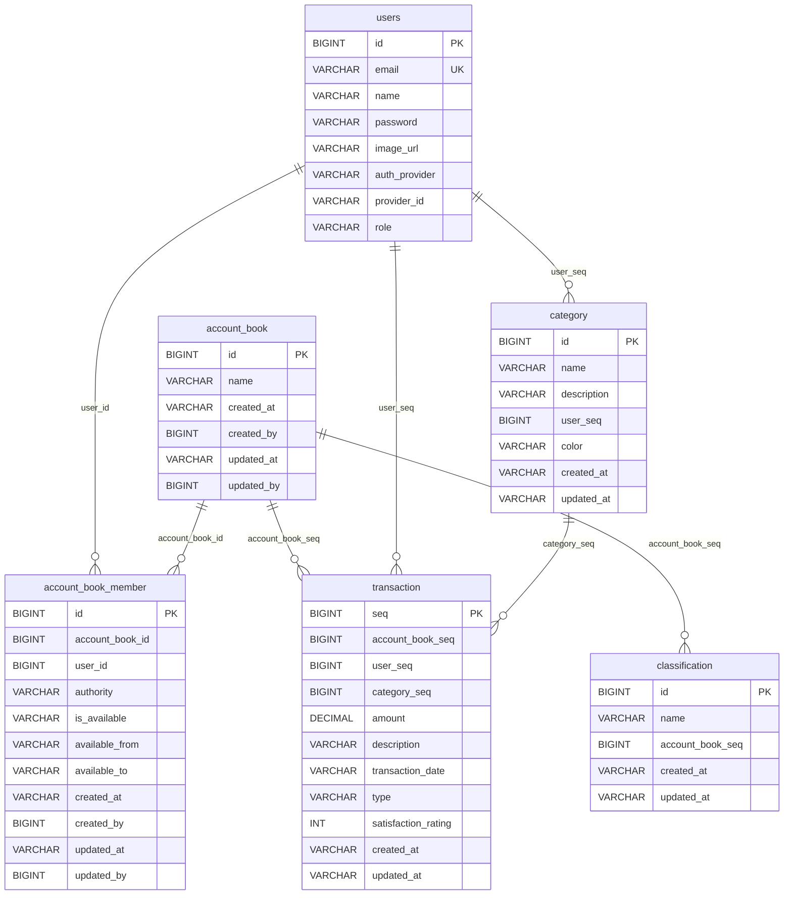

# Sodam 데이터 모델 명세서

## 문서 목적

이 문서는 현재 Flyway migration과 도메인 모델을 기준으로 Sodam의 데이터 모델, 테이블 구조, 논리 관계를 정리한다.

## ERD

> 현재 migration에는 물리 FK 제약이 정의되어 있지 않다. 위 ERD의 관계는 컬럼명과 서비스 로직 기준의 논리 관계이다.

## 테이블 목록

| 테이블 | 서비스 | 설명 |
| --- | --- | --- |
| `users` | `user-service` | 사용자 계정 |
| `account_book` | `account-book-service` | 가계부 |
| `account_book_member` | `account-book-service` | 가계부 접근 권한 |
| `category` | `category-service` | 사용자별 거래 카테고리 |
| `classification` | `category-service` | 가계부별 수입/지출 분류 |
| `transaction` | `transaction-service` | 거래 내역 |

## users

| 컬럼 | 타입 | 제약 | 설명 |
| --- | --- | --- | --- |
| `id` | `BIGINT` | PK, auto increment | 사용자 ID |
| `email` | `VARCHAR(255)` | Unique | 이메일 |
| `name` | `VARCHAR(255)` | - | 사용자 이름 |
| `password` | `VARCHAR(255)` | - | 암호화된 비밀번호 |
| `image_url` | `VARCHAR(255)` | - | OAuth 프로필 이미지 URL |
| `auth_provider` | `VARCHAR(255)` | - | 인증 제공자 |
| `provider_id` | `VARCHAR(255)` | - | OAuth 제공자 사용자 ID |
| `role` | `VARCHAR(255)` | - | 사용자 역할 |

## account_book

| 컬럼 | 타입 | 제약 | 설명 |
| --- | --- | --- | --- |
| `id` | `BIGINT` | PK, auto increment | 가계부 ID |
| `name` | `VARCHAR(255)` | - | 가계부 이름 |
| `created_at` | `VARCHAR(14)` | Not Null | 생성 일시 |
| `created_by` | `BIGINT` | - | 생성 사용자 ID |
| `updated_at` | `VARCHAR(14)` | Not Null | 수정 일시 |
| `updated_by` | `BIGINT` | - | 수정 사용자 ID |

## account_book_member

| 컬럼 | 타입 | 제약 | 설명 |
| --- | --- | --- | --- |
| `id` | `BIGINT` | PK, auto increment | 멤버 ID |
| `account_book_id` | `BIGINT` | Index | 가계부 ID |
| `user_id` | `BIGINT` | Index | 사용자 ID |
| `authority` | `VARCHAR(255)` | - | 권한. 생성자는 `OWNER` |
| `is_available` | `VARCHAR(255)` | - | 사용 가능 여부 |
| `available_from` | `VARCHAR(14)` | - | 접근 시작 일시 |
| `available_to` | `VARCHAR(14)` | - | 접근 종료 일시 |
| `created_at` | `VARCHAR(14)` | Not Null | 생성 일시 |
| `created_by` | `BIGINT` | - | 생성 사용자 ID |
| `updated_at` | `VARCHAR(14)` | Not Null | 수정 일시 |
| `updated_by` | `BIGINT` | - | 수정 사용자 ID |

## category

| 컬럼 | 타입 | 제약 | 설명 |
| --- | --- | --- | --- |
| `id` | `BIGINT` | PK, auto increment | 카테고리 ID |
| `name` | `VARCHAR(255)` | - | 카테고리 이름 |
| `description` | `VARCHAR(255)` | - | 설명 |
| `user_seq` | `BIGINT` | Index | 소유 사용자 ID |
| `color` | `VARCHAR(255)` | - | 표시 색상 |
| `created_at` | `VARCHAR(14)` | Not Null | 생성 일시 |
| `updated_at` | `VARCHAR(14)` | Not Null | 수정 일시 |

## classification

| 컬럼 | 타입 | 제약 | 설명 |
| --- | --- | --- | --- |
| `id` | `BIGINT` | PK, auto increment | 분류 ID |
| `name` | `VARCHAR(255)` | - | 분류 이름. 예: `INCOME`, `EXPENSE` |
| `account_book_seq` | `BIGINT` | Index | 가계부 ID |
| `created_at` | `VARCHAR(14)` | Not Null | 생성 일시 |
| `updated_at` | `VARCHAR(14)` | Not Null | 수정 일시 |

## transaction

| 컬럼 | 타입 | 제약 | 설명 |
| --- | --- | --- | --- |
| `seq` | `BIGINT` | PK, auto increment | 거래 ID |
| `account_book_seq` | `BIGINT` | Index | 가계부 ID |
| `user_seq` | `BIGINT` | Index | 사용자 ID |
| `category_seq` | `BIGINT` | Index | 카테고리 ID |
| `amount` | `DECIMAL(19,2)` | Not Null | 금액 |
| `description` | `VARCHAR(255)` | - | 설명 |
| `transaction_date` | `VARCHAR(14)` | Not Null, Index | 거래 일시 |
| `type` | `VARCHAR(20)` | Not Null | `INCOME` 또는 `EXPENSE` |
| `satisfaction_rating` | `INT` | - | 만족도 1~5 |
| `created_at` | `VARCHAR(14)` | Not Null | 생성 일시 |
| `updated_at` | `VARCHAR(14)` | Not Null | 수정 일시 |

## 주요 관계 및 규칙

| 관계 | 설명 |
| --- | --- |
| 사용자 - 가계부 | `account_book_member.user_id`로 사용자가 접근 가능한 가계부를 판단한다. |
| 가계부 - 멤버 | 가계부 생성 시 생성자를 `OWNER` 멤버로 등록한다. |
| 가계부 - 분류 | 회원가입 시 기본 가계부에 `INCOME`, `EXPENSE` 분류를 생성한다. |
| 사용자 - 카테고리 | 카테고리는 사용자 ID인 `user_seq`에 귀속된다. |
| 거래 - 사용자 | 거래 생성 시 인증 이메일로 사용자 ID를 조회해 `user_seq`에 저장한다. |
| 거래 - 카테고리 | 거래는 `category_seq`로 카테고리를 참조한다. 카테고리 삭제 시 거래를 대체 카테고리로 이동한다. |

## 인덱스

| 테이블 | 인덱스 | 컬럼 | 목적 |
| --- | --- | --- | --- |
| `users` | `uk_users_email` | `email` | 이메일 중복 방지 및 로그인 조회 |
| `account_book_member` | `idx_account_book_member_account_book_id` | `account_book_id` | 가계부별 멤버 조회 |
| `account_book_member` | `idx_account_book_member_user_id` | `user_id` | 사용자별 접근 가계부 조회 |
| `category` | `idx_category_user_seq` | `user_seq` | 사용자별 카테고리 조회 |
| `classification` | `idx_type_account_book_seq` | `account_book_seq` | 가계부별 분류 조회 |
| `transaction` | `idx_transaction_account_book_seq` | `account_book_seq` | 가계부별 거래 조회 |
| `transaction` | `idx_transaction_user_seq` | `user_seq` | 사용자별 거래 조회 |
| `transaction` | `idx_transaction_category_seq` | `category_seq` | 카테고리별 거래 조회/이동 |
| `transaction` | `idx_transaction_transaction_date` | `transaction_date` | 기간 검색 및 정렬 |

## 날짜 형식

현재 주요 일시 컬럼은 `VARCHAR(14)` 타입을 사용한다. 애플리케이션에서는 거래일시를 `YYYYMMDDHHmmss` 형식으로 다룬다.

## 마이그레이션 기준 파일

| 서비스 | 파일 |
| --- | --- |
| `user-service` | `backend/user-service/src/main/resources/db/migration/V1__init_user_service.sql` |
| `account-book-service` | `backend/account-book-service/src/main/resources/db/migration/V1__init_account_book_service.sql` |
| `category-service` | `backend/category-service/src/main/resources/db/migration/V1__init_category_service.sql` |
| `transaction-service` | `backend/transaction-service/src/main/resources/db/migration/V1__init_transaction_service.sql` |
